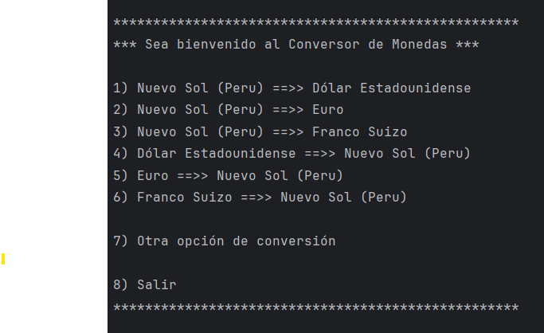
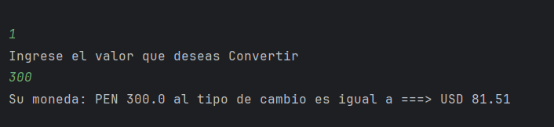
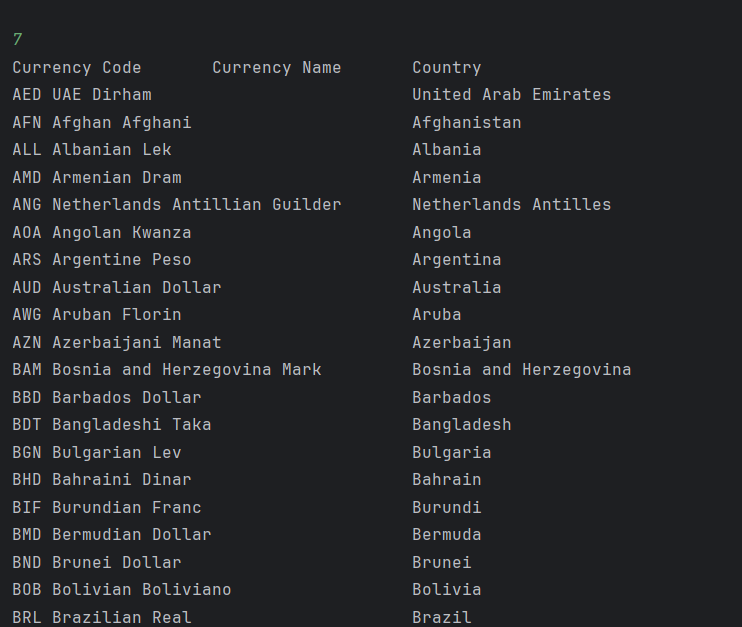
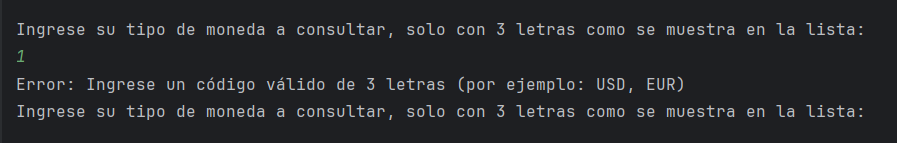
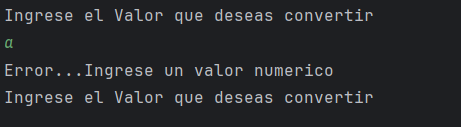
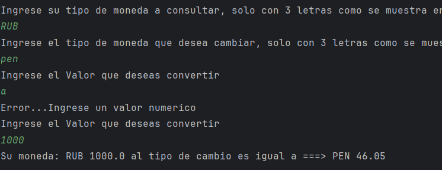
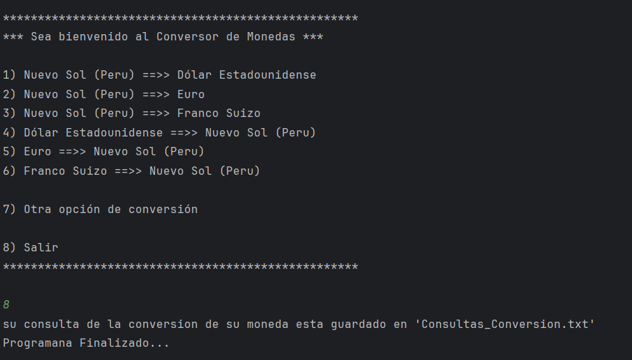
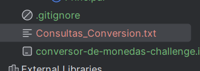
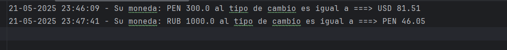

# 💱 Conversor de Monedas Challenge

<p align = "center">

</p>

Es una aplicación sencilla de consola que permite convertir entre diferentes tipos de monedas...rápidas, precisas y sin complicaciones.

## 🚀 Características

- Conversión entre múltiples monedas usando tasas actualizadas.
- Validación de entrada para asegurar que los códigos de moneda sean válidos (3 letras).
- Manejo de errores amigable para el usuario.
- Interfaz de consola clara y fácil de usar.

## 🛠️ Tecnologías utilizadas

- **Java** (JDK 21.0.6)
- **Scanner** para entrada por consola
-  API externa para tasas de cambio en tiempo real

## 📦 Cómo ejecutar

1. Clona este repositorio:
   ```bash
   git clone https://github.com/thort93/Conversor-De-Monedas-Challenge.git
   cd conversor-monedas

## 🔒 Validaciones
  - Solo se aceptan códigos de moneda válidos de 3 letras (ej: USD, EUR, PEN).
  - El valor ingresado para convertir debe ser numérico.

## 📦 DEMOSTRACION (CAPTURAS DE PANTALLA)

### Menu principal
- Al ejecutar la aplicacion nos muestra en siguiente menu
  


### Escoge una opcion.
- para este ejemplo escogemos la opcion 1 , ingresamos el valor a convertir y nos muestra el resultado
  


### Escogiendo otra opcion para convertir
- Para este ejemplo escogemos la opcion 7 y nos muestra una lista de tipo de monedas
  


### Errores al colocar un valor incorrecto
- tanto paraa el tipo de modena y el valor de la monera muestra un error
  en caso de que no se consigne las 3 letras (PEN,USD) pedira nuevamente
  hasta colocarlo correctamente, de igual manera para el valor numerico
  




### luego de superar el error muestra el resultado



### luego le damos salir opcion 8



### guarda las consultas




